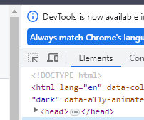
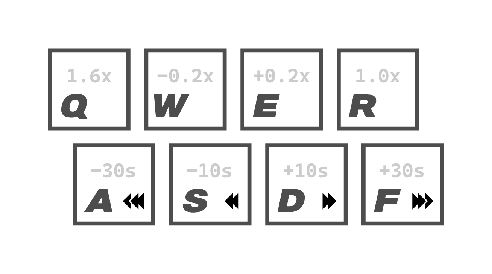

# LMS CONTROL JS
## Vanilla Download Method
1. LMS의 **강의 영상이 나오도록 실행**하기
2. 개발자모드 창에서 좌상단에 아래와 같은 표시가 있음. 노트북/스마트폰 표시 옆의 아이콘을 누르기\

3. 실행한 강의 영상 누르면 바로 강의 영상의 링크가 나옴.

- 대게 F12를 이용해 Internet Browser(Chrome, Edge, Whale, ...)의 **개발자모드**를 활성화할 수 있음.

## Use Script
1. 강의를 들어가면 좌하단에 다운로드 버튼이 생김.
2. 누르면 다른 새 창으로 넘어감
   - 자동적으로 영상이 실행됨.
   - Intro 실행이후, 열린 창이 닫히고 강의링크를 다른 새 창으로 열림

- 만약 바로 안열리면, 강의가 열린 창을 새로 고침해 다운로드 버튼을 다시 누를 것
- 그래도 안된다면, 위의 Vanulla Download Method를 사용할 것.
- Vanilla Download Method는 다운로드버튼을 눌렀을 때 나오는 창에도 적용이 가능함.

## Video Control
브라우져에서 열린 영상을 Control할 수 있도록 Key binding을 해두었음. 해당 기능은 아래의 그림과 같음.\
